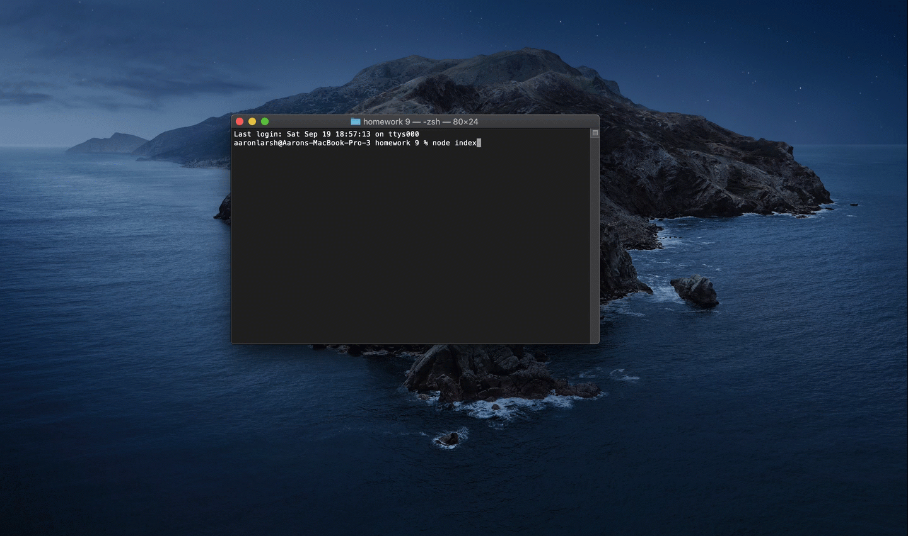

# Good README Generator

## Description
This application is for helping people create amazing readmes in a mater of minutes. Allowing developers to develop!
---
## Table of Contents
* [Installation](#Installation)
* [Usage](#Usage)
* [License](#License)
* [Contributing](#Contributing)
* [Tests](#Tests)
* [Questions](#Questions)

---
## Installation
1. Navigate to: [My App](https://github.com/AaronLarsh/ReadMeGenerator)
1. Download Repo
1. Do an NPM install of all required packets 
1. Open in terminal
1. Type "node index"
1. Follow all prompts

---

## Demo

 
[Example readme created](https://github.com/AaronLarsh/ReadMeGenerator/blob/master/newReadME.md)
---
## Questions
GitHub: https://github.com/aaronlarsh
 
Email: aaronlarsh@hotmail.com
  
---

